# HTML & CSS Basics - Assignment 1

## Student Information

**Name:** Aidana Muratova

**Group:** SE-2539

**University:** Astana IT University

## About the Project

This project is a simple personal webpage created using HTML and CSS.

The webpage contains information about me, my hobbies, favorite websites, university subjects, a contact form, and some basic CSS styling.
## Final Website

### Homepage

This is the final version of my personal webpage created with HTML and CSS.

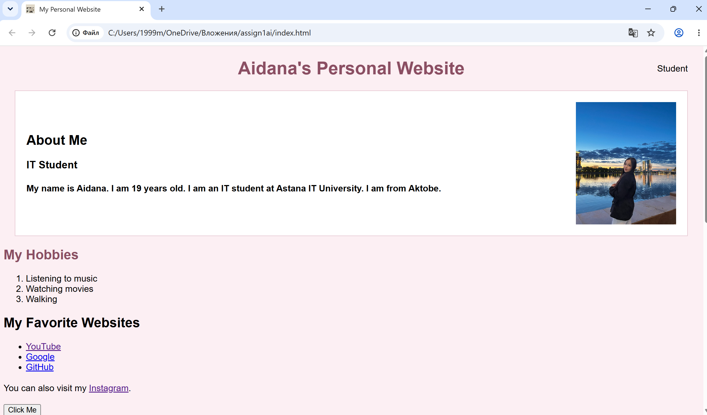

### Contact Form and Table

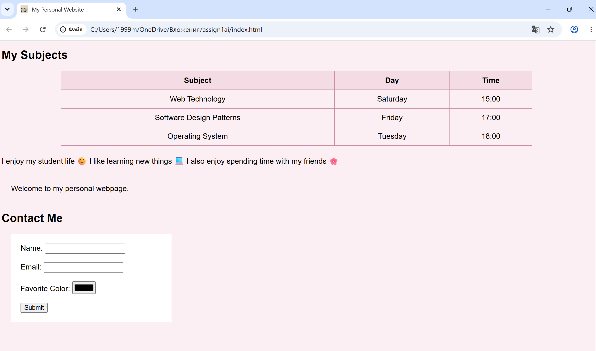

## Tasks Completed

### Part 1 - HTML Basics

#### Step 0. Basic HTML Structure

Created the basic HTML structure with `DOCTYPE`, `html`, `head`, `body`, and `title`.

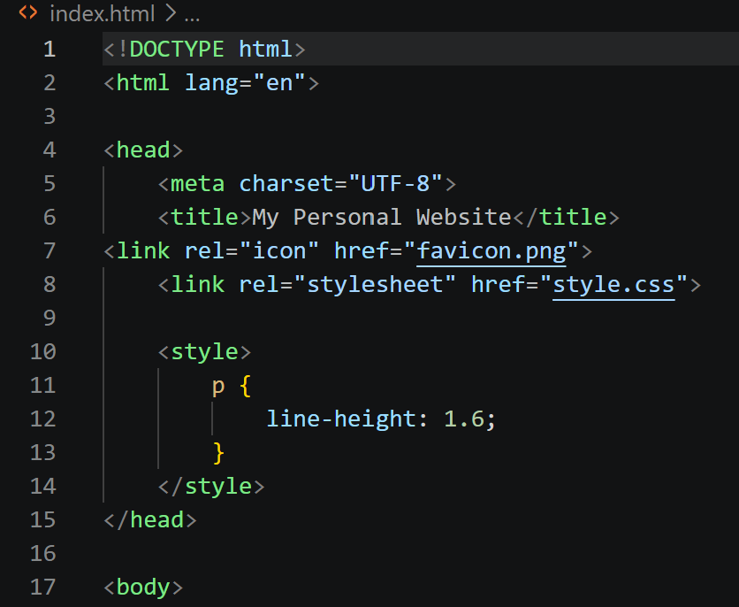

#### Step 1. Headings and Paragraphs

Added headings from `h1` to `h3` and paragraphs with information about me.

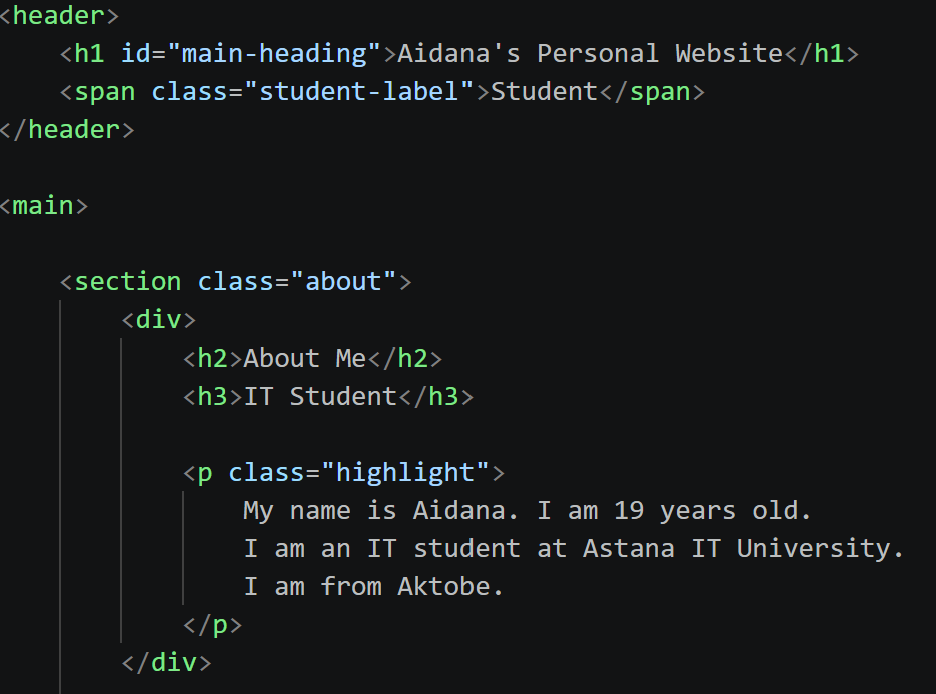

#### Step 2. Ordered and Unordered Lists

Created an ordered list of my hobbies and an unordered list of my favorite websites.

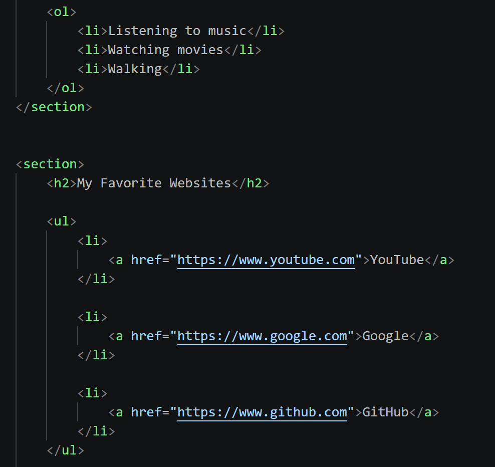

#### Step 3. Image and Links

Added my personal photo and several links to websites.

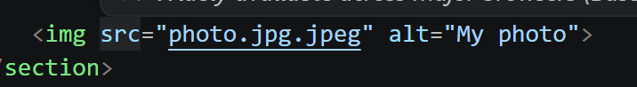

#### Step 4. Button

Added a "Click Me" button that opens my Instagram page.

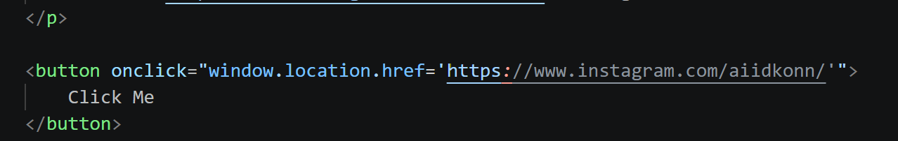

---

### Part 2 - Tables and Forms

#### Step 5. Table

Created a table containing subjects, days, and class times.

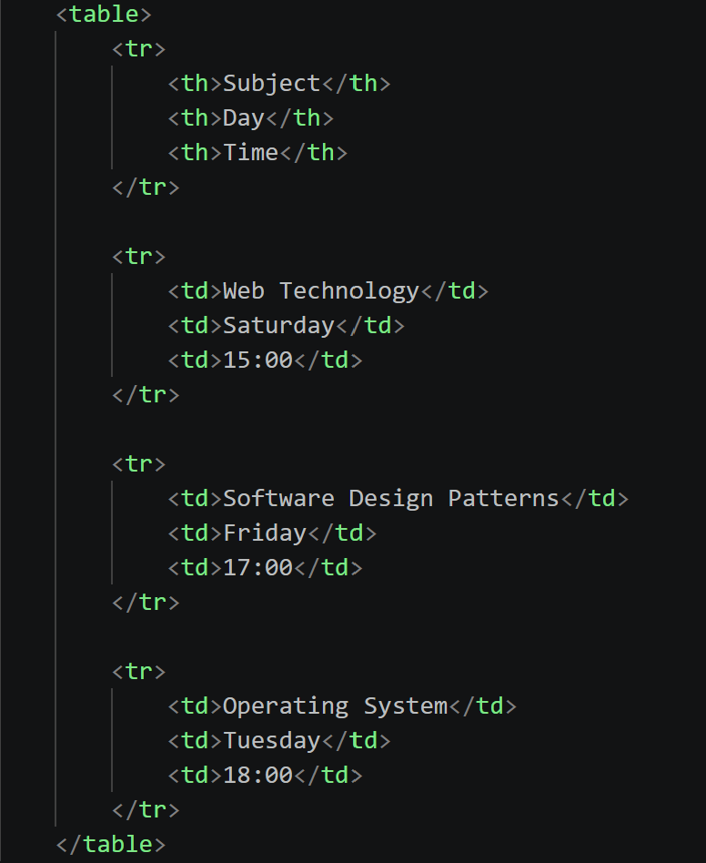

#### Step 6. Table Layout - Optional Challenge

This was an optional challenge and was not implemented.

#### Step 7. Emojis

Added three emojis to a paragraph about my student life.

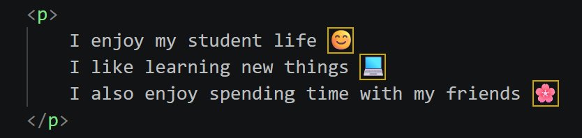

#### Step 8. Form

Created a contact form with Name, Email, Favorite Color, and Submit inputs.

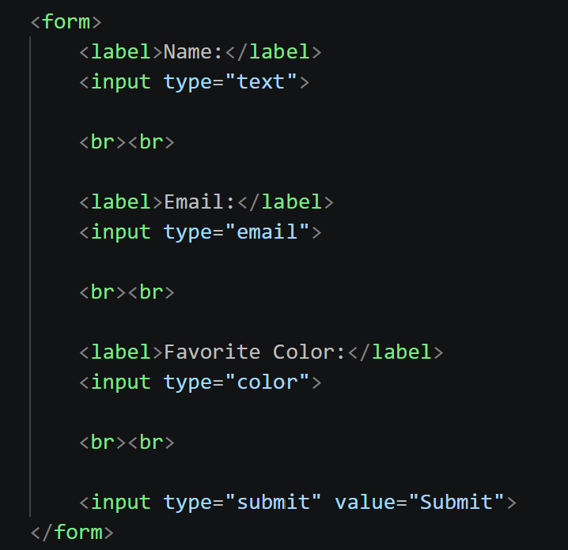

---

### Part 3 - CSS

#### Step 9. Introduction to CSS

Connected the external `style.css` file and added basic styling for the webpage.

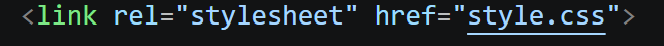

#### Step 10. Inline CSS

Used inline CSS to change the color of the "My Hobbies" heading.


#### Step 11. Internal CSS

Used internal CSS inside the `<style>` element to change paragraph line height.

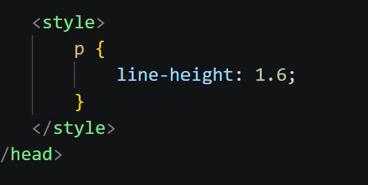

#### Step 12. External CSS

Created and connected the external `style.css` file.


#### Step 13. CSS Selectors

Used element, class, and ID selectors in the project.
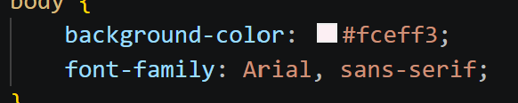

.png)

.png)

#### Step 14. Classes and IDs

Used the `.highlight` class and `#main-heading` ID selector.


---

### Part 4 - Additional CSS Features

#### Step 15. Favicon

Added a favicon to the webpage.

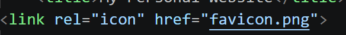

#### Step 16. HTML Divs

Used `<div>` elements to organize webpage content.

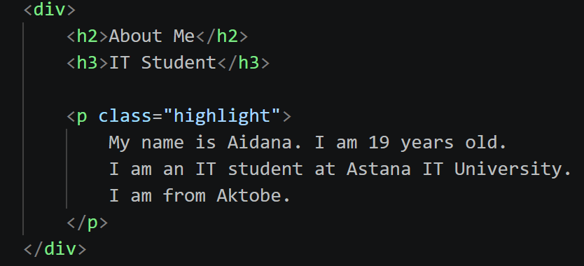

#### Step 17. CSS Box Model

Used margin, padding, and borders to style the webpage elements.

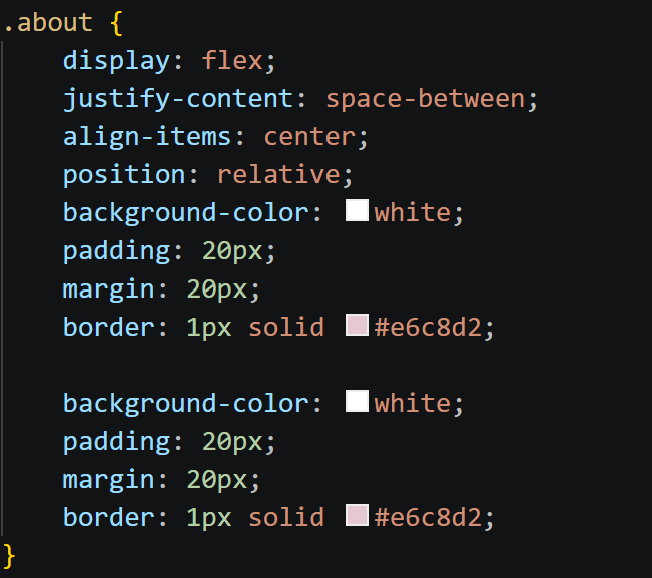

#### Step 18. CSS Positioning

Used `static`, `relative`, and `absolute` positioning.
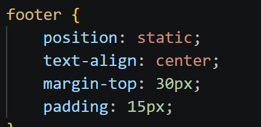

.png)

.png)

.png)

#### Step 19. CSS Units

Used `px`, `%`, `em`, and `rem` units.

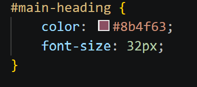

#### Step 20. Float and Clear

Used `float` and `clear` properties.

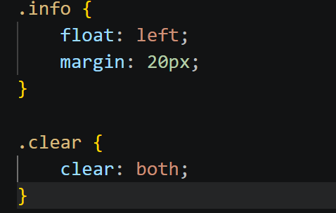

#### Step 21. Publishing the Website

Prepared and published the webpage using GitHub Pages.
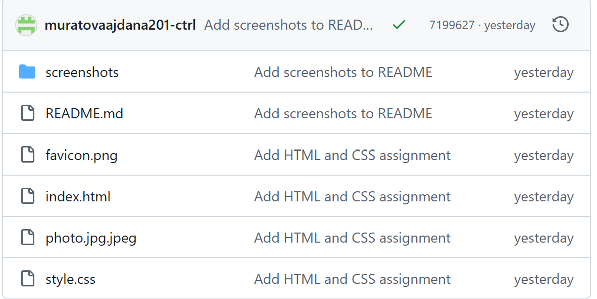

.png)

.png)

---

## Technologies Used

* HTML5
* CSS3
* GitHub
* GitHub Pages

## Project Files

```text
assignment1/
├── index.html
├── style.css
├── photo.jpg.jpeg
├── favicon.png
├── README.md
└── screenshots/
    ├── step0.png
    ├── step1.png
    ├── step2.png
    ├── step3.png
    ├── step4.png
    ├── step5.png
    ├── step7.png
    ├── step8.png
    ├── step9.png
    ├── step10.png
    ├── step11.png
    ├── step12.png
    ├── Step13(1).png
    ├── Step13(2).png
    ├── step14.png
    ├── step15.png
    ├── step16.png
    ├── step17.png
    ├── Step18(1).png
    ├── Step18(2).png
    ├── Step18(3).png
    ├── step19.png
    ├── step20.png
    ├── Step21(1).png
    └── Step21(2).png
```

## Work Process

First, I created the basic HTML structure of the webpage and added headings, paragraphs, lists, image, links, button, table and form.

Then I added CSS styling. I used inline, internal and external CSS and practiced different selectors, colors, fonts, margins, padding, borders and positioning.

After that, I added a favicon, div elements, CSS units, float and clear properties.

Finally, I prepared the project for publishing and published the webpage using GitHub Pages.

## Conclusion

This assignment helped me practice the basic HTML and CSS features. I learned how HTML provides the structure of a webpage and how CSS controls its appearance, spacing and layout. I also learned how to publish a webpage using GitHub Pages.
